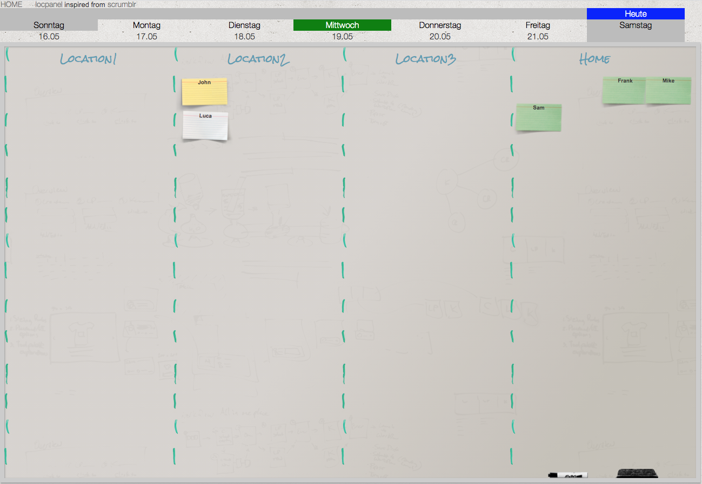

# locpanel

Electronic magnetboard for displaying the presence status.

It was inspired by [scrumblr from aliasaria](https://github.com/aliasaria/scrumblr), but some functions have been left out for the sake of clarity.

Some other functions have been added

* Replace MongoDB with sqlite or MSSQL as database.
* Daily reset of the cards into 'HOME' area.
* Single, or Multipanel-Mode (see image) to plan the future days.
* (todo) User authentication and authorization. Only users with card can access the board.
* (todo) UI in read only mode. All boards, labeling and cards are specified via an admin area.



## Getting Started
### Configuration
Create `.env` file and edit it to your needs.
```shell
cp .env.sample .env
```

Create `./config/config.js` file and edit it to your needs.
```shell
cd ./config

cp .config.sample.sqlite.js config.js
or
cp .config.sample.mssql.js config.js
```

With `locpanel.sqlite` you can use a sqlite database from scratch.

Use `./config/db.sql` as schema import file, if you want to use MSSQL as backend.

### Installation

Install node modules
```shell
npm install
```

Run server in development mode
```shell
npm run start:dev
```

Run server in production mode
```shell
npm run start
```